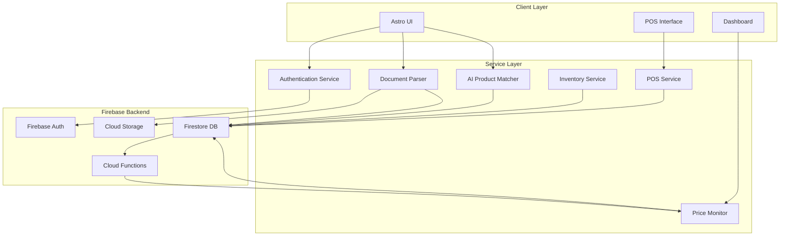

# Technical Design Document: PRO SYNAPSE

## Overview

PRO SYNAPSE is an AI-Powered Supplier Pricelist Analysis and Retail Management System designed for TPRO Dynamics. The system integrates supplier data management, intelligent product matching, price monitoring, inventory tracking, receiving operations, and point-of-sale functionality into a unified platform.

### Technology Stack

- **Frontend Framework**: Astro 7.x with TypeScript (strict mode)
- **Backend Platform**: Firebase (Firestore database, Authentication, Cloud Functions, Storage)
- **Runtime**: Node.js 22.12.0+
- **AI/ML**: Firebase ML Kit or external AI service for product matching
- **Document Processing**: PDF.js for PDF parsing, SheetJS for Excel processing

### Design Philosophy

The system follows a modular architecture with clear separation of concerns:

- **Presentation Layer**: Astro pages and components for user interface
- **Service Layer**: TypeScript modules encapsulating business logic
- **Data Access Layer**: Firebase SDK wrappers for database operations
- **Integration Layer**: Parsers, matchers, and external service adapters

### Key Design Decisions

1. **Astro for Frontend**: Chosen for its zero-JavaScript-by-default approach, providing excellent performance for dashboard and data-heavy pages while allowing interactive islands where needed
2. **Firebase Backend**: Provides managed authentication, real-time database, cloud storage, and serverless functions, reducing infrastructure complexity
3. **Parser Round-Trip Design**: All document parsers include corresponding pretty-printers to ensure data fidelity and enable format conversion
4. **Optimistic UI Updates**: POS and inventory operations use optimistic updates with background synchronization for responsiveness
5. **Event-Driven Architecture**: Price changes, inventory updates, and alerts use Firebase Cloud Functions triggered by database writes

## Architecture

### System Architecture



### Component Architecture

**Authentication Component**
- Wraps Firebase Authentication
- Manages session state and token refresh
- Implements role-based access control middleware
- Handles account lockout after failed attempts

**Document Processing Pipeline**
- **Upload Handler**: Receives files via Astro API routes, stores in Cloud Storage
- **Parser Factory**: Routes documents to appropriate parser (CSV, Excel, PDF)
- **Data Validator**: Validates extracted data structures
- **Pretty Printer**: Converts structured data back to document format

**AI Product Matcher**
- **Exact Matcher**: Performs direct SKU code comparison
- **Fuzzy Matcher**: Uses text similarity algorithms (Levenshtein distance, cosine similarity)
- **ML Matcher**: Integrates with AI service for semantic product description matching
- **Confidence Scorer**: Calculates match confidence percentage
- **Learning Module**: Improves matching from user confirmations

**Price Monitoring System**
- **Comparison Engine**: Compares current vs. previous pricelists
- **Change Detector**: Identifies price differences
- **Alert Generator**: Creates notifications for significant changes (>10%)
- **History Tracker**: Maintains time-series price data

**Inventory Management**
- **Transaction Processor**: Handles receiving and sales transactions
- **Quantity Calculator**: Updates inventory levels atomically
- **Location Tracker**: Manages multi-location inventory
- **Alert System**: Monitors reorder points and generates alerts

**POS System**
- **Product Lookup**: Fast SKU-based product retrieval
- **Transaction Builder**: Constructs sale records
- **Payment Processor**: Integrates payment methods
- **Offline Queue**: Caches transactions when network unavailable

### Data Flow Patterns

**Pricelist Processing Flow**
1. User uploads pricelist file → Cloud Storage
2. Storage trigger → Cloud Function
3. Parser extracts data → Firestore (raw pricelist collection)
4. Matcher compares products → Creates matches/flags unmatched
5. Price Monitor compares with previous → Records price changes
6. Dashboard updates → Real-time listeners notify UI

**Receiving Flow**
1. User uploads invoice/delivery receipt → Parser extracts data
2. System matches line items → Existing products
3. User confirms/adjusts quantities → Creates receiving record
4. Transaction committed → Inventory quantities updated (Firestore transaction)
5. Cloud Function triggered → Updates reorder alerts if needed

**POS Transaction Flow**
1. Scan product → Lookup in Firestore (cached locally)
2. Add to cart → Update local state
3. Complete sale → Create transaction record
4. Optimistic inventory update → Local state
5. Background sync → Firestore with retry logic
6. If conflict detected → Resolve with last-write-wins or user prompt

## Components and Interfaces

### Frontend Components (Astro)

**Layout Components**
```typescript
// src/layouts/MainLayout.astro
interface MainLayoutProps {
  title: string;
  requireAuth?: boolean;
  requiredRole?: UserRole;
}
```

**Page Components**
- `/` - Dashboard
- `/login` - Authentication
- `/suppliers` - Supplier management
- `/pricelists` - Pricelist upload and review
- `/products` - Product catalog
- `/matching` - Product matching queue
- `/inventory` - Inventory status
- `/receiving` - Receiving operations
- `/pos` - Point of sale
- `/reports` - Analytics and reporting
- `/admin/users` - User management

**Interactive Islands (React/Vue/Svelte - TBD)**
- ProductMatchReview: Confirms suggested matches
- PriceChangeAlert: Displays significant price changes
- POSInterface: Real-time transaction interface
- InventorySearch: Fast product search with autocomplete

### Service Layer Interfaces

**Authentication Service**
```typescript
interface AuthService {
  login(email: string, password: string): Promise<UserSession>;
  logout(): Promise<void>;
  getCurrentUser(): Promise<User | null>;
  checkPermission(user: User, permission: Permission): boolean;
  lockAccount(userId: string, duration: number): Promise<void>;
}

interface UserSession {
  userId: string;
  email: string;
  role: UserRole;
  token: string;
  expiresAt: Date;
}

type UserRole = 'Administrator' | 'Manager' | 'Analyst' | 'Clerk' | 'Sales_Associate';
type Permission = 'manage_users' | 'manage_suppliers' | 'upload_pricelists' | 
                  'approve_matches' | 'adjust_inventory' | 'process_sales' | 'generate_reports';
```

**Document Parser Service**
```typescript
interface ParserService {
  parsePricelist(file: File): Promise<PricelistData>;
  parseInvoice(file: File): Promise<InvoiceData>;
  parseDeliveryReceipt(file: File): Promise<DeliveryReceiptData>;
  detectFormat(file: File): Promise<DocumentFormat>;
}

interface PrettyPrinterService {
  printPricelist(data: PricelistData): Promise<string>; // CSV format
  printInvoice(data: InvoiceData): Promise<string>;
  printDeliveryReceipt(data: DeliveryReceiptData): Promise<string>;
}

interface PricelistData {
  supplierId: string;
  uploadDate: Date;
  items: PricelistItem[];
}

interface PricelistItem {
  supplierCode: string;
  description: string;
  price: number;
  uom?: string;
}

interface InvoiceData {
  supplierName: string;
  invoiceNumber: string;
  invoiceDate: Date;
  lineItems: InvoiceLineItem[];
  totalAmount: number;
}

interface InvoiceLineItem {
  productCode: string;
  description: string;
  quantity: number;
  unitPrice: number;
  lineTotal: number;
}

interface DeliveryReceiptData {
  supplierName: string;
  deliveryDate: Date;
  lineItems: DeliveryLineItem[];
}

interface DeliveryLineItem {
  productCode: string;
  description: string;
  quantity: number;
}

type DocumentFormat = 'csv' | 'excel' | 'pdf';
```

**Product Matching Service**
```typescript
interface MatcherService {
  matchProducts(pricelist: PricelistData): Promise<MatchingResult>;
  suggestMatch(supplierProduct: PricelistItem): Promise<MatchSuggestion[]>;
  confirmMatch(supplierCode: string, internalSKU: string): Promise<void>;
  findUnmatchedProducts(supplierId: string): Promise<UnmatchedProduct[]>;
}

interface MatchingResult {
  matched: MatchedProduct[];
  unmatched: UnmatchedProduct[];
  suggestions: MatchSuggestion[];
}

interface MatchedProduct {
  supplierCode: string;
  internalSKU: string;
  confidence: number; // 1.0 for exact, <1.0 for fuzzy
  matchType: 'exact' | 'fuzzy' | 'confirmed';
}

interface UnmatchedProduct {
  supplierCode: string;
  description: string;
  supplierId: string;
  uploadDate: Date;
}

interface MatchSuggestion {
  supplierCode: string;
  suggestedSKU: string;
  productName: string;
  confidence: number; // 0.0 to 1.0
  reason: string; // explanation of match basis
}
```

**Price Monitoring Service**
```typescript
interface PriceMonitorService {
  detectPriceChanges(newPricelist: PricelistData): Promise<PriceChange[]>;
  getPriceHistory(sku: string, supplierId: string): Promise<PriceHistoryEntry[]>;
  getSignificantChanges(threshold: number, dateRange: DateRange): Promise<PriceChange[]>;
}

interface PriceChange {
  sku: string;
  supplierId: string;
  oldPrice: number;
  newPrice: number;
  absoluteChange: number;
  percentageChange: number;
  changeDate: Date;
  isSignificant: boolean; // >10%
}

interface PriceHistoryEntry {
  price: number;
  effectiveDate: Date;
  source: string; // pricelist reference
}

interface DateRange {
  start: Date;
  end: Date;
}
```

**Inventory Service**
```typescript
interface InventoryService {
  getQuantityOnHand(sku: string, locationId?: string): Promise<number>;
  adjustInventory(adjustment: InventoryAdjustment): Promise<void>;
  processReceiving(receiving: ReceivingRecord): Promise<void>;
  processSale(transaction: POSTransaction): Promise<void>;
  getLowStockItems(locationId?: string): Promise<LowStockAlert[]>;
  getInventoryHistory(sku: string, dateRange: DateRange): Promise<InventoryTransaction[]>;
}

interface InventoryAdjustment {
  sku: string;
  locationId: string;
  quantityChange: number;
  reason: 'receiving' | 'sale' | 'adjustment' | 'return';
  userId: string;
  timestamp: Date;
  notes?: string;
}

interface ReceivingRecord {
  receivingId: string;
  supplierId: string;
  receivingDate: Date;
  documentType: 'invoice' | 'delivery_receipt';
  lineItems: ReceivingLineItem[];
  status: 'pending' | 'completed';
}

interface ReceivingLineItem {
  sku: string;
  quantity: number;
  locationId: string;
  expectedQuantity?: number; // for variance detection
}

interface LowStockAlert {
  sku: string;
  currentQuantity: number;
  reorderPoint: number;
  locationId: string;
}

interface InventoryTransaction {
  transactionId: string;
  sku: string;
  quantityBefore: number;
  quantityAfter: number;
  transactionType: string;
  timestamp: Date;
  userId: string;
}
```

**POS Service**
```typescript
interface POSService {
  lookupProduct(sku: string): Promise<ProductPOS>;
  createTransaction(transaction: POSTransactionDraft): Promise<POSTransaction>;
  voidTransaction(transactionId: string, userId: string): Promise<void>;
  getTransactionHistory(dateRange: DateRange): Promise<POSTransaction[]>;
}

interface ProductPOS {
  sku: string;
  description: string;
  price: number;
  availableQuantity: number;
  category: string;
}

interface POSTransactionDraft {
  lineItems: POSLineItem[];
  paymentMethod: PaymentMethod;
  userId: string;
}

interface POSTransaction {
  transactionId: string;
  timestamp: Date;
  lineItems: POSLineItem[];
  subtotal: number;
  tax: number;
  total: number;
  paymentMethod: PaymentMethod;
  userId: string;
  status: 'completed' | 'voided';
}

interface POSLineItem {
  sku: string;
  description: string;
  quantity: number;
  unitPrice: number;
  lineTotal: number;
}

type PaymentMethod = 'cash' | 'card' | 'mobile';
```

**Reporting Service**
```typescript
interface ReportingService {
  generateSalesReport(config: SalesReportConfig): Promise<Report>;
  generateInventoryReport(config: InventoryReportConfig): Promise<Report>;
  generateSupplierReport(config: SupplierReportConfig): Promise<Report>;
  exportReport(reportId: string, format: 'pdf' | 'excel'): Promise<Blob>;
  saveReportConfig(config: ReportConfig): Promise<string>;
  loadReportConfig(configId: string): Promise<ReportConfig>;
}

interface Report {
  reportId: string;
  title: string;
  generatedAt: Date;
  data: any; // report-specific data structure
  summary: ReportSummary;
}

interface ReportSummary {
  totalRecords: number;
  aggregates: Record<string, number>;
}

interface SalesReportConfig extends ReportConfig {
  groupBy: 'product' | 'category' | 'day' | 'week' | 'month';
  includeMargin: boolean;
}

interface InventoryReportConfig extends ReportConfig {
  includeValue: boolean;
  includeTurnover: boolean;
}

interface SupplierReportConfig extends ReportConfig {
  metrics: ('price_stability' | 'delivery_reliability' | 'product_range')[];
}

interface ReportConfig {
  dateRange: DateRange;
  filters: Record<string, any>;
}
```

## Data Models

### Firebase Firestore Collections

**users**
```typescript
interface UserDoc {
  userId: string; // document ID
  email: string;
  displayName: string;
  role: UserRole;
  isActive: boolean;
  createdAt: Timestamp;
  lastLoginAt: Timestamp;
  failedLoginAttempts: number;
  lockedUntil?: Timestamp;
}
```

**suppliers**
```typescript
interface SupplierDoc {
  supplierId: string; // document ID
  name: string;
  contactPerson: string;
  email: string;
  phone: string;
  address: string;
  isActive: boolean;
  createdAt: Timestamp;
  updatedAt: Timestamp;
  createdBy: string; // userId
}
```

**products**
```typescript
interface ProductDoc {
  sku: string; // document ID
  description: string;
  category: string;
  unitOfMeasure: string;
  reorderPoint: number;
  isActive: boolean;
  createdAt: Timestamp;
  updatedAt: Timestamp;
  supplierMappings: SupplierMapping[];
}

interface SupplierMapping {
  supplierId: string;
  supplierCode: string;
  lastCost: number;
  lastCostDate: Timestamp;
}
```

**pricelists**
```typescript
interface PricelistDoc {
  pricelistId: string; // document ID
  supplierId: string;
  uploadDate: Timestamp;
  fileName: string;
  storageRef: string; // Cloud Storage path
  itemCount: number;
  processedAt: Timestamp;
  uploadedBy: string; // userId
}
```

**pricelist_items**
```typescript
interface PricelistItemDoc {
  itemId: string; // document ID
  pricelistId: string;
  supplierId: string;
  supplierCode: string;
  description: string;
  price: number;
  uom?: string;
  matchStatus: 'matched' | 'unmatched' | 'suggested';
  matchedSKU?: string;
  matchConfidence?: number;
  isNewProduct: boolean;
}
```

**price_changes**
```typescript
interface PriceChangeDoc {
  changeId: string; // document ID
  sku: string;
  supplierId: string;
  oldPrice: number;
  newPrice: number;
  absoluteChange: number;
  percentageChange: number;
  changeDate: Timestamp;
  isSignificant: boolean;
  oldPricelistId: string;
  newPricelistId: string;
}
```

**inventory**
```typescript
interface InventoryDoc {
  inventoryId: string; // document ID: {sku}_{locationId}
  sku: string;
  locationId: string;
  quantityOnHand: number;
  lastUpdated: Timestamp;
  lastTransactionId: string;
}
```

**inventory_transactions**
```typescript
interface InventoryTransactionDoc {
  transactionId: string; // document ID
  sku: string;
  locationId: string;
  transactionType: 'receiving' | 'sale' | 'adjustment' | 'void';
  quantityChange: number;
  quantityBefore: number;
  quantityAfter: number;
  timestamp: Timestamp;
  userId: string;
  referenceId?: string; // receiving ID or POS transaction ID
  notes?: string;
}
```

**receiving_records**
```typescript
interface ReceivingRecordDoc {
  receivingId: string; // document ID
  supplierId: string;
  receivingDate: Timestamp;
  documentType: 'invoice' | 'delivery_receipt';
  documentRef?: string; // Cloud Storage path
  lineItems: ReceivingLineItem[];
  status: 'pending' | 'completed';
  createdBy: string; // userId
  createdAt: Timestamp;
  completedAt?: Timestamp;
}
```

**invoices**
```typescript
interface InvoiceDoc {
  invoiceId: string; // document ID
  supplierId: string;
  invoiceNumber: string;
  invoiceDate: Timestamp;
  storageRef: string; // Cloud Storage path
  lineItems: InvoiceLineItem[];
  totalAmount: number;
  receivingId?: string;
  hasVariance: boolean;
  processedAt: Timestamp;
  uploadedBy: string;
}
```

**pos_transactions**
```typescript
interface POSTransactionDoc {
  transactionId: string; // document ID
  timestamp: Timestamp;
  lineItems: POSLineItem[];
  subtotal: number;
  tax: number;
  total: number;
  paymentMethod: PaymentMethod;
  userId: string;
  status: 'completed' | 'voided';
  voidedAt?: Timestamp;
  voidedBy?: string;
  syncStatus: 'synced' | 'pending' | 'failed';
}
```

**pricing**
```typescript
interface PricingDoc {
  pricingId: string; // document ID: {sku}_{tier}
  sku: string;
  priceTier: 'standard' | 'wholesale' | 'vip';
  retailPrice: number;
  effectiveDate: Timestamp;
  updatedBy: string;
  updatedAt: Timestamp;
}
```

**report_configs**
```typescript
interface ReportConfigDoc {
  configId: string; // document ID
  userId: string;
  name: string;
  reportType: 'sales' | 'inventory' | 'supplier';
  config: any; // report-specific configuration
  createdAt: Timestamp;
  lastUsed: Timestamp;
}
```

### Firestore Indexes

Required composite indexes for performance:

1. `pricelist_items`: `(supplierId, matchStatus, isNewProduct)`
2. `price_changes`: `(changeDate DESC, isSignificant)`
3. `inventory_transactions`: `(sku, timestamp DESC)`
4. `pos_transactions`: `(timestamp DESC, status)`
5. `products`: `(category, isActive)`
6. `inventory`: `(quantityOnHand ASC)` for low stock queries

### Data Validation Rules

**Firestore Security Rules** will enforce:
- Authenticated access for all collections
- Role-based read/write permissions
- User can only void their own transactions (or admin override)
- Price changes are write-once (immutable audit trail)
- Inventory adjustments require reason and userId

**Application-Level Validations**:
- SKU uniqueness across active products
- Positive quantities for inventory and sales
- Non-negative prices with max 2 decimal places
- Required fields per document schema
- Referential integrity checks before writes


## Correctness Properties

*A property is a characteristic or behavior that should hold true across all valid executions of a system—essentially, a formal statement about what the system should do. Properties serve as the bridge between human-readable specifications and machine-verifiable correctness guarantees.*

### Property Reflection

After analyzing all acceptance criteria, I identified the following testable properties. Many requirements are infrastructure, UI, or integration concerns better suited for integration tests. The properties below focus on pure algorithmic logic where property-based testing provides maximum value:

**Redundancy Analysis:**
- Properties 2, 3 (exact and fuzzy matching) can be combined into a single comprehensive matching property
- Properties 4, 5 (inventory increase/decrease) both test quantity arithmetic and can be unified
- Properties 11, 12, 13 (parser round-trips) are structurally identical—each validates parser correctness for different document types

**Consolidated Properties:**
The following properties represent unique, non-redundant validations:

### Property 1: Pricelist Round-Trip Preservation

*For any* valid pricelist data structure, parsing it to a document format (CSV), then parsing that document back, SHALL produce an equivalent data structure with identical product codes, descriptions, and prices.

**Validates: Requirements 3.7**

### Property 2: Invoice Round-Trip Preservation

*For any* valid invoice data structure, printing it to document format, then parsing that document back, SHALL produce an equivalent data structure with identical supplier name, invoice number, date, line items, quantities, prices, and total amount.

**Validates: Requirements 10.7**

### Property 3: Delivery Receipt Round-Trip Preservation

*For any* valid delivery receipt data structure, printing it to document format, then parsing that document back, SHALL produce an equivalent data structure with identical supplier name, delivery date, and line items with quantities.

**Validates: Requirements 11.7**

### Property 4: Parser Error Handling

*For any* malformed or corrupted document (pricelist, invoice, or delivery receipt), the parser SHALL return a descriptive error message indicating the specific parsing failure rather than crashing or returning partial/incorrect data.

**Validates: Requirements 3.3, 10.2, 11.2**

### Property 5: Product Matching Correctness

*For any* supplier product code, if it exactly matches an internal SKU code, the matcher SHALL create a Matched_Product link with confidence 1.0. *For any* supplier product with no exact match, the matcher SHALL invoke fuzzy matching on the description.

**Validates: Requirements 4.1, 4.2, 4.3**

### Property 6: Match Confidence Threshold Classification

*For any* fuzzy match result with confidence score, if confidence exceeds 0.85, the system SHALL suggest the match for user review. If confidence is below 0.85, the system SHALL classify the product as Unmatched_Product.

**Validates: Requirements 4.4, 4.5**

### Property 7: New Product Detection

*For any* two pricelists from the same supplier, the system SHALL correctly identify products present in the new pricelist but absent from the previous pricelist as new products.

**Validates: Requirements 5.1, 5.2**

### Property 8: Price Change Detection and Calculation

*For any* matched product with two different prices (old and new), the Price_Monitor SHALL correctly calculate the absolute difference and percentage change. The formula SHALL be: `percentage_change = ((new_price - old_price) / old_price) * 100`.

**Validates: Requirements 6.1, 6.2**

### Property 9: Significant Price Change Flagging

*For any* price change with a calculated percentage change, if the percentage increase exceeds 10%, the system SHALL flag the change as significant. Price decreases or increases ≤10% SHALL NOT be flagged as significant.

**Validates: Requirements 6.3**

### Property 10: Inventory Quantity Adjustment

*For any* inventory record with current quantity Q and transaction with quantity change ΔQ (positive for receiving, negative for sales), the system SHALL calculate the new quantity as Q' = Q + ΔQ, ensuring the calculation is performed atomically.

**Validates: Requirements 8.2, 8.3**

### Property 11: Low Stock Alert Generation

*For any* product with current quantity Q and defined reorder point R, if Q < R, the system SHALL generate a low stock alert. If Q ≥ R, no alert SHALL be generated.

**Validates: Requirements 8.4**

### Property 12: Receiving Variance Detection

*For any* receiving record with expected quantity E and received quantity R, if |R - E| / E > 0.05 (5% difference), the system SHALL flag the receiving record for review.

**Validates: Requirements 9.5**

### Property 13: Invoice Variance Detection

*For any* invoice line item with invoice quantity/price and corresponding receiving record quantity/price, if the difference exceeds 5% for either quantity or price, the system SHALL flag the variance for review.

**Validates: Requirements 10.4**

### Property 14: Retail Price Calculation with Margin

*For any* supplier cost C and configured margin percentage M, the system SHALL calculate suggested retail price as: `retail_price = C * (1 + M/100)`, rounded to 2 decimal places.

**Validates: Requirements 12.2**

### Property 15: Negative Margin Detection

*For any* proposed retail price P and supplier cost C, if P < C (negative margin), the system SHALL display a warning before allowing the price to be saved.

**Validates: Requirements 12.6**

### Property 16: POS Line Total Calculation

*For any* transaction line item with quantity Q and unit price P, the system SHALL calculate line total as: `line_total = Q * P`, rounded to 2 decimal places.

**Validates: Requirements 13.2**

### Property 17: Transaction Void Inventory Reversal

*For any* completed POS transaction with line items and quantities that decreased inventory, when the transaction is voided, the system SHALL increase inventory quantities by exactly the same amounts that were originally decreased, restoring inventory to its pre-transaction state.

**Validates: Requirements 13.5**


## Error Handling

### Error Categories and Strategies

**1. Validation Errors**
- **Examples**: Missing required fields, invalid data types, duplicate SKUs, negative quantities
- **Handling**: Return descriptive error messages to the user interface with specific field references
- **User Experience**: Display inline validation errors next to relevant form fields
- **Logging**: Log validation failures at INFO level for analytics

**2. Parse Errors**
- **Examples**: Corrupted file format, missing columns, unexpected structure, encoding issues
- **Handling**: Parser catches exceptions and returns structured error with failure reason
- **User Experience**: Display error message with specific parsing failure ("Missing 'price' column in row 5")
- **Logging**: Log parse errors at WARN level with file metadata for troubleshooting
- **Recovery**: Allow user to review error and re-upload corrected file

**3. Business Logic Errors**
- **Examples**: Insufficient inventory for sale, invoice variance exceeds threshold, price results in negative margin
- **Handling**: Validate business rules before committing transactions
- **User Experience**: Display warning dialogs with options to proceed (override) or cancel
- **Logging**: Log business rule violations at WARN level
- **Audit Trail**: Record overrides with user identity and justification

**4. Database Errors**
- **Examples**: Firestore write failures, network timeouts, constraint violations, concurrent modification conflicts
- **Handling**: Implement retry logic with exponential backoff for transient failures
- **User Experience**: Display generic error for infrastructure failures ("Unable to save. Please try again.")
- **Logging**: Log database errors at ERROR level with stack traces
- **Recovery**: For critical operations (POS, inventory), implement offline queue and sync when available

**5. Authentication/Authorization Errors**
- **Examples**: Invalid credentials, expired session, insufficient permissions
- **Handling**: Redirect to login for authentication failures; display "Access Denied" for authorization failures
- **User Experience**: Clear messaging about why access was denied
- **Logging**: Log auth failures at WARN level with IP address and timestamp
- **Security**: Implement account lockout after repeated failed login attempts (Requirements 19.6)

**6. External Service Errors**
- **Examples**: AI matching service unavailable, payment processor timeout
- **Handling**: Graceful degradation (e.g., skip fuzzy matching if AI service down)
- **User Experience**: Display notification about reduced functionality
- **Logging**: Log external service failures at ERROR level
- **Monitoring**: Alert operations team for extended outages

**7. System Errors**
- **Examples**: Unexpected exceptions, out-of-memory, unhandled edge cases
- **Handling**: Global error boundary catches unhandled exceptions
- **User Experience**: Display friendly error page with support contact
- **Logging**: Log at CRITICAL level with full context and stack trace
- **Recovery**: Log detailed diagnostic information for debugging

### Error Response Format

All API endpoints return consistent error format:

```typescript
interface ErrorResponse {
  error: {
    code: string; // e.g., "VALIDATION_ERROR", "PARSE_ERROR"
    message: string; // user-friendly message
    details?: any; // additional context (field errors, etc.)
    timestamp: string;
    requestId: string; // for support troubleshooting
  };
}
```

### Logging Strategy

**Log Levels**:
- **DEBUG**: Detailed diagnostic information for development
- **INFO**: Normal operation events (user login, pricelist processed)
- **WARN**: Abnormal but handled situations (validation failures, business rule violations)
- **ERROR**: Failures requiring attention (database errors, external service failures)
- **CRITICAL**: System-threatening failures requiring immediate response

**Log Aggregation**: Use Firebase Cloud Logging or external service (Datadog, New Relic) for centralized log management

**Sensitive Data**: Never log passwords, payment details, or PII. Redact sensitive fields.

### Firestore Transaction Error Handling

**Optimistic Locking**: Use Firestore transactions for inventory updates to prevent race conditions

```typescript
try {
  await db.runTransaction(async (transaction) => {
    const inventoryRef = db.collection('inventory').doc(inventoryId);
    const doc = await transaction.get(inventoryRef);
    const currentQty = doc.data().quantityOnHand;
    const newQty = currentQty + quantityChange;
    
    if (newQty < 0) {
      throw new Error('Insufficient inventory');
    }
    
    transaction.update(inventoryRef, { quantityOnHand: newQty });
  });
} catch (error) {
  if (error.message === 'Insufficient inventory') {
    // Business logic error - show user-friendly message
  } else {
    // Transaction conflict or database error - retry
  }
}
```

### Offline Support for POS

**Queue-Based Sync**:
1. POS operations write to local IndexedDB queue
2. Background sync worker attempts to push to Firestore
3. Retry with exponential backoff for failures
4. Display sync status indicator in UI
5. Alert user if sync queue exceeds threshold (e.g., 100 transactions)

**Conflict Resolution**: Last-write-wins for POS transactions (transactions are append-only, so conflicts are rare)

## Testing Strategy

### Testing Approach Overview

PRO SYNAPSE requires a comprehensive testing strategy that balances property-based testing for algorithmic correctness with integration testing for infrastructure and UI components.

### Property-Based Testing (PBT)

**When Applied**: Pure functions and algorithmic logic where behavior varies meaningfully with input and 100+ iterations provide value.

**Library**: Use **fast-check** for TypeScript/JavaScript property-based testing

**Configuration**:
- Minimum 100 iterations per property test
- Configurable seed for reproducibility
- Shrinking enabled to find minimal failing examples

**Test Organization**:
```
tests/
  properties/
    parsers.property.test.ts
    matching.property.test.ts
    pricing.property.test.ts
    inventory.property.test.ts
```

**Property Test Template**:
```typescript
import * as fc from 'fast-check';

describe('Property: Pricelist Round-Trip Preservation', () => {
  it('for any valid pricelist data, parsing→printing→parsing preserves data', () => {
    // Feature: pro-synapse, Property 1: Pricelist Round-Trip Preservation
    
    fc.assert(
      fc.property(
        pricelistDataArbitrary(), // custom generator
        (pricelistData) => {
          const csv = prettyPrinter.printPricelist(pricelistData);
          const reparsed = parser.parsePricelist(csv);
          
          expect(reparsed).toEqual(pricelistData);
        }
      ),
      { numRuns: 100 }
    );
  });
});
```

**Custom Generators (Arbitraries)**:
- `pricelistDataArbitrary()`: Generates valid PricelistData with random items
- `invoiceDataArbitrary()`: Generates valid InvoiceData with line items
- `deliveryReceiptDataArbitrary()`: Generates valid DeliveryReceiptData
- `productPairArbitrary()`: Generates supplier product and internal SKU pairs
- `priceChangeArbitrary()`: Generates old/new price pairs
- `inventoryStateArbitrary()`: Generates inventory record with quantity

**Property Tests to Implement**:

1. **Document Round-Trip Properties** (Properties 1-3)
   - Pricelist parsing ↔ printing
   - Invoice parsing ↔ printing
   - Delivery receipt parsing ↔ printing

2. **Parser Error Handling** (Property 4)
   - Generate malformed documents (missing columns, invalid types, corrupted data)
   - Verify descriptive error messages returned

3. **Product Matching** (Properties 5-6)
   - Exact match detection
   - Fuzzy match invocation
   - Confidence threshold classification

4. **Price Monitoring** (Properties 7-9)
   - New product detection (set difference)
   - Price change calculation (arithmetic)
   - Significant change flagging (threshold logic)

5. **Inventory Management** (Properties 10-11)
   - Quantity adjustment arithmetic
   - Low stock alert generation

6. **Variance Detection** (Properties 12-13)
   - Receiving variance calculation
   - Invoice variance calculation

7. **Pricing Calculations** (Properties 14-16)
   - Retail price calculation with margin
   - Negative margin detection
   - POS line total calculation

8. **Transaction Reversal** (Property 17)
   - Void correctly reverses inventory changes

### Unit Testing

**When Applied**: Specific examples, edge cases, and scenarios not covered by property tests.

**Framework**: Use **Vitest** for unit testing (fast, modern, good DX)

**Coverage Targets**:
- Service layer functions: 90%+ coverage
- Parser/matcher logic: 95%+ coverage
- Calculation functions: 100% coverage

**Unit Test Examples**:

1. **Example-Based Tests**
   - Authentication flows (valid/invalid credentials)
   - CRUD operations (create supplier, update product)
   - Form validation (required fields, data types)
   - State transitions (activate/deactivate)

2. **Edge Case Tests**
   - Empty pricelist file
   - Single-item invoice
   - Zero quantity receiving
   - Product with no supplier mappings
   - Price change from $0.00 to $0.01
   - Inventory at exactly reorder point

3. **Boundary Tests**
   - Maximum file size (10,000 items)
   - Percentage thresholds (exactly 5%, 10%)
   - Decimal precision (prices with >2 decimal places)

### Integration Testing

**When Applied**: Infrastructure, external services, database operations, UI flows, and end-to-end scenarios.

**Framework**: Use **Playwright** for end-to-end tests, **Vitest** with Firebase emulator for integration tests

**Firebase Emulator Suite**: Use local Firestore, Auth, and Storage emulators for integration tests

**Integration Test Categories**:

1. **Authentication Integration**
   - Firebase Auth login/logout flows
   - Session management and token refresh
   - Role-based access control enforcement
   - Account lockout mechanism

2. **Database Integration**
   - Firestore write/read operations
   - Transaction atomicity (inventory updates)
   - Query performance (search, filtering)
   - Security rules enforcement

3. **Document Upload Pipeline**
   - File upload to Cloud Storage
   - Storage trigger → Cloud Function
   - Parsing and database write
   - Error notification flow

4. **UI Integration**
   - Page navigation and routing
   - Form submission and validation display
   - Dashboard metrics rendering
   - Real-time data updates

5. **Offline/Sync Integration**
   - POS offline queue mechanism
   - Background sync when connectivity restored
   - Conflict resolution

**Test Data Management**: Use factories to generate consistent test data

```typescript
// tests/factories/supplier.factory.ts
export function createSupplier(overrides = {}) {
  return {
    supplierId: randomUUID(),
    name: 'Test Supplier',
    email: 'supplier@test.com',
    isActive: true,
    createdAt: Timestamp.now(),
    ...overrides
  };
}
```

### Performance Testing

**Tools**: Use **Artillery** or **k6** for load testing

**Performance Requirements to Validate**:
- UI response time <500ms (95th percentile)
- Database queries <2 seconds for 1000 records
- Pricelist processing: 10,000 items in <60 seconds
- Product matching: 1000 operations in <30 seconds
- 50 concurrent users without degradation

**Performance Test Scenarios**:
1. Dashboard load with concurrent users
2. Large pricelist upload and processing
3. Bulk product matching
4. High-volume POS transactions
5. Report generation with large datasets

### Security Testing

**Automated Security Scans**:
- Dependency vulnerability scanning (npm audit)
- SAST (Static Application Security Testing)
- Firebase Security Rules validation

**Manual Security Testing**:
- Authentication bypass attempts
- Authorization escalation tests
- SQL injection / NoSQL injection attempts (though Firestore SDK mitigates)
- XSS and CSRF protection validation
- Session management security

### Testing Workflow

**Development Workflow**:
1. Write property tests for new algorithmic logic
2. Write unit tests for specific examples
3. Run tests locally with `npm test`
4. Pre-commit hook runs linter + tests
5. CI/CD pipeline runs full test suite

**Continuous Integration**:
- Run all unit tests + property tests on every commit
- Run integration tests on pull requests
- Run performance tests nightly
- Generate coverage reports

**Test Execution Commands**:
```bash
npm test                    # Run all tests
npm test:unit               # Unit tests only
npm test:properties         # Property-based tests only
npm test:integration        # Integration tests (requires emulator)
npm test:e2e                # End-to-end tests
npm test:coverage           # Generate coverage report
```

### Test-Driven Development (TDD) for Properties

**Recommended Workflow**:
1. Write failing property test based on design property
2. Implement minimal code to pass property test
3. Refactor for clarity and performance
4. Add edge case unit tests as needed
5. Verify with integration test if infrastructure involved

**Example TDD Flow for Property 1 (Pricelist Round-Trip)**:
1. Write property test with custom generator
2. Test fails (parser not implemented)
3. Implement CSV parser
4. Test fails (pretty printer not implemented)
5. Implement pretty printer
6. Test passes with 100 iterations
7. Add edge case unit tests (empty pricelist, special characters)

### Acceptance Testing

**Definition of Done**:
- All property tests passing (100 iterations each)
- Unit test coverage ≥90%
- All integration tests passing
- Manual UAT completed for critical flows
- Performance requirements validated
- Security scan shows no critical vulnerabilities

**Critical User Acceptance Scenarios**:
1. Upload supplier pricelist and review matches
2. Process receiving and update inventory
3. Complete POS transaction
4. View dashboard with live metrics
5. Generate and export sales report
6. Manage user accounts and permissions

